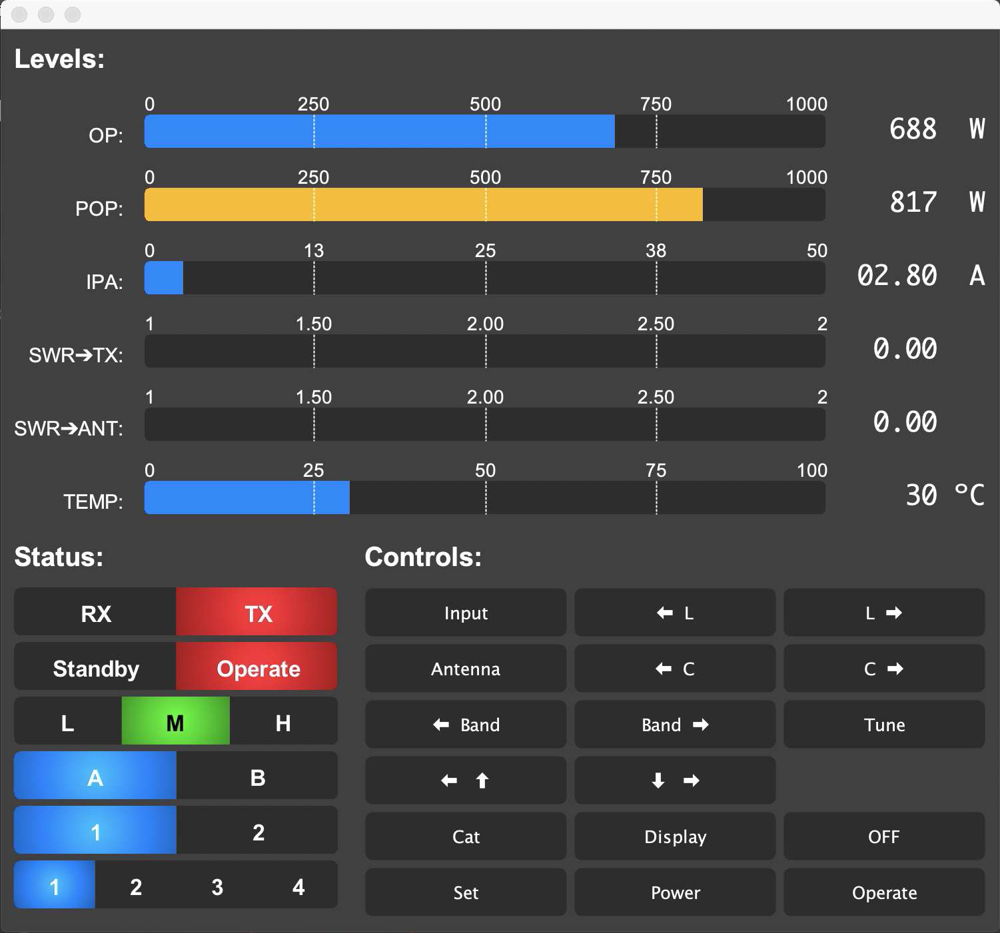

# Expert1.3k

This app displays the status and controlls of an 
Expert 1.3k amplifier connected by usb.
The interface allows both a light and a dark mode,
which looks like this:

Currently, this app only works on MacOS but since it is
fully written in Java it should be easy enough to port
it to other environments
